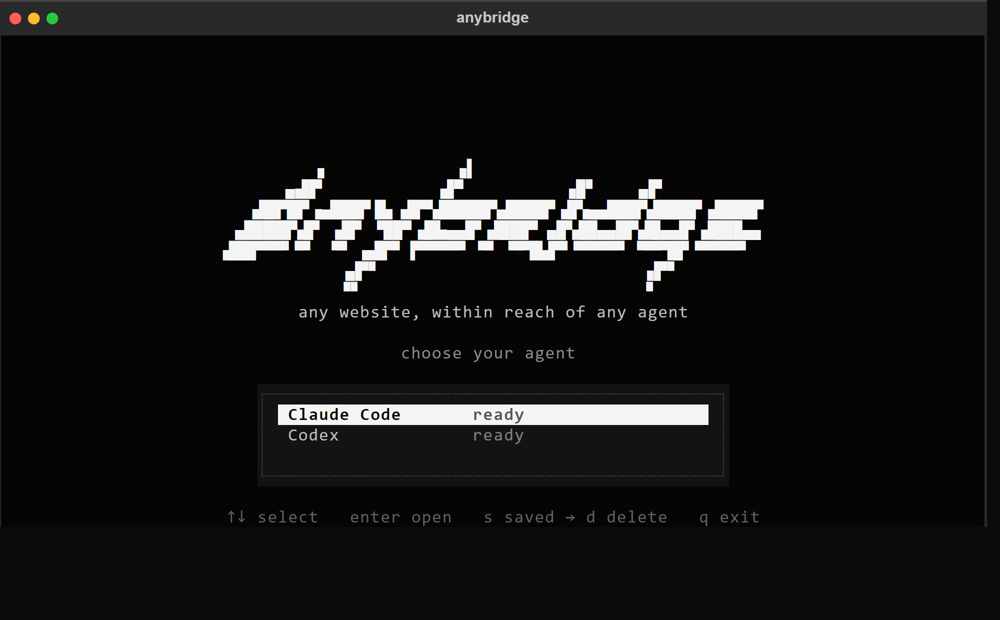

# anybridge

**Any website, within reach of any agent.**

<p align="center">
  
</p>

anybridge turns a website into tools an AI agent can actually use. It opens the
page in a real browser and re-exposes it over the **Model Context Protocol**, so
Claude Code, Codex, or anything else that speaks MCP can read the page, fill its
forms, click its buttons and read its PDFs — including sites built long before
agents existed.

Run it, pick your agent, paste a URL into it. That is the whole flow.

## Why it exists

[WebMCP](https://github.com/webmachinelearning/webmcp) lets a website declare
typed, callable tools for AI agents. It is real and already deployed — Shopify
ships it on storefronts today — but only Gemini in Chrome can consume those
tools. anybridge captures them and hands them to **every other agent**.

And when a site has no WebMCP at all, which is almost every site, anybridge
generates the bridge itself from the live DOM. A 2013 SharePoint portal and a
modern Shopify store come out the same way: as a list of tools.

## What an agent gets

Two sources of tools, merged, with the site's own taking precedence:

**The site's native WebMCP tools**, namespaced so a page can never shadow a
built-in — `search_catalog`, `update_cart`, whatever the site registered.

**Forty universal tools that work on any page.** The ones that matter most:

| | |
|---|---|
| `navigate`, `read_page`, `smart_read` | open and read, with PDFs returned as page-marked text |
| `snapshot` | a compact semantic tree with stable refs (`@e12`) instead of raw HTML |
| `click_ref`, `fill_ref`, `select_ref`, `press_key` | act on those refs |
| `extract`, `screenshot`, `wait_for` | structured data, images, synchronisation |
| `save_site`, `save_profile`, `save_workflow` | remember a site, a login, a recorded flow |
| `open_repository` | clone a Git remote and hand back a local path |

## Run it

One command, nothing installed. [uv](https://docs.astral.sh/uv/) fetches
anybridge and its Python for you, and anybridge downloads its browser on first
run:

```bash
uvx --from git+https://github.com/JustVugg/anybridge anybridge
```

That opens the TUI: pick your agent, and anybridge launches it in a second
terminal already wired to the bridge.

To keep it around, install it properly (Python 3.10 or newer):

```bash
git clone https://github.com/JustVugg/anybridge.git
cd anybridge
pip install -e .
```

On a bare Linux box `sudo playwright install-deps chromium` supplies Chromium's
system libraries. Not on PyPI yet.

## Use it

**Wire it into an MCP client:**

```bash
claude mcp add anybridge -- anybridge serve
```

```json
{
  "mcpServers": {
    "anybridge": { "command": "anybridge", "args": ["serve"] }
  }
}
```

**Or from the shell, with no agent at all:**

```bash
anybridge list https://www.bauzaar.it/     # the site's WebMCP tools plus the built-ins
anybridge call https://en.wikipedia.org/wiki/Rome read_page
```

**Or as a library**, when you want tools your framework already understands:

```python
from anybridge import BridgeSession
from langgraph.prebuilt import create_react_agent

async with BridgeSession("https://www.bauzaar.it/") as site:
    agent = create_react_agent("anthropic:claude-sonnet-5", site.langchain_tools())
```

`site.anthropic_tools()`, `site.openai_tools()` and `site.tool_specs()` cover the
other frameworks. One browser backs the whole session, so calls share page state.

## How it holds up

**It picks the cheapest route that works.** Plain HTTP first, then optional
Lightpanda, and Chromium only when the page truly needs JavaScript or state.

**It stays available.** Every route is bounded by one shared deadline. If the
live site fails, anybridge degrades to a durable cache and finally to the
Internet Archive — and says so, instead of pretending an action succeeded.

**PDFs are text, never screenshots.** Chromium's PDF viewer exposes an empty
DOM, so anybridge extracts the document, marks every page, and lets an agent
ask for `pages="12-15"` of a long one.

**Untrusted pages stay in their box.** Remote sessions get their own browser,
private-network targets are blocked including across redirects, saved profiles
are encrypted and scoped to one origin, and recorded workflows never store the
values that were typed into them.

## Limits

Aggressive anti-bot walls can still refuse a headless browser. When that
happens anybridge reports what the page actually served and continues read-only
from another source — it never invents a completed purchase, login or form
submission. Archived pages are historical and cannot be used for live actions.

## Development

```bash
python -m pytest tests/                                              # 49 tests
ANYBRIDGE_SKIP_BROWSER_TESTS=1 python -m unittest discover -s tests   # without a browser
```

## License

MIT
